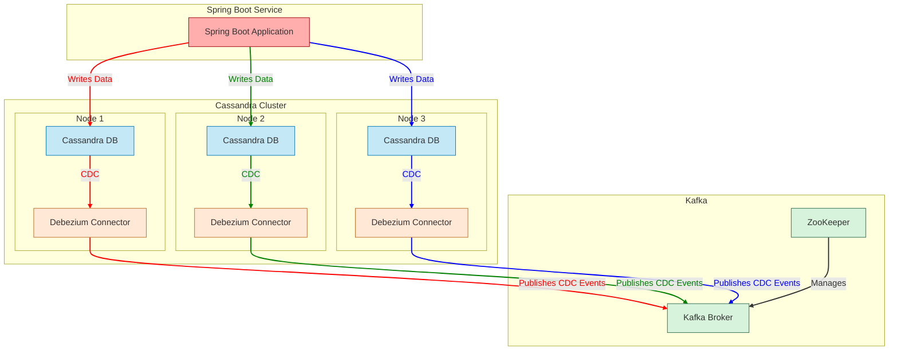

# Cassandra-Debezium POC

## Quickstart
```bash
# Clean start script which starts all containers with clean volumes
./clean-start.sh

# Consume messages from the transactions topic
docker-compose -f docker-compose-cassandra.yaml exec kafka bash -c '/kafka/bin/kafka-console-consumer.sh --bootstrap-server kafka:9092 --from-beginning --property print.key=true --topic test_prefix.testdb.transactions'

# To view the auto-insertion logs (auto insert disabled by default):
docker-compose -f docker-compose-cassandra.yaml exec cassandra-1 bash -c 'tail -f /tmp/auto-insert.log'

# Connect to Cassandra CQL shell in another terminal
docker-compose -f docker-compose-cassandra.yaml exec cassandra-1 bash -c 'cqlsh --keyspace=testdb'

# Start the Spring Boot service (in a separate terminal)
cd spring-boot-cassandra
mvn spring-boot:run
```

## References 
- [Cassandra CDC Docs](https://cassandra.apache.org/doc/latest/cassandra/managing/operating/cdc.html)
- [Debezium connector for Cassandra](https://debezium.io/documentation/reference/stable/connectors/cassandra.html)
- [Official debezium examples repository](https://github.com/debezium/debezium-examples/blob/main/tutorial/README.md#using-cassandra)

## Overview and important information

This project demonstrates how to set up and use the Debezium connector for Apache Cassandra to capture and stream data changes (Change Data Capture or CDC) to Apache Kafka. <br>
It was forked from the official debezium-examples repo and stripped down to include only what's necessary for running a Cassandra CDC PoC using Debezium.

The `config.properties` here includes two critical properties that are missing in the official example, which are essential to trigger near real-time CDC events even for small changes:

```bash
# These 2 properties are important for triggering real time CDC events.
# If set to false CDC events will be sent in batches only when the max batch size is reached.
commit.log.real.time.processing.enabled=true
commit.log.marked.complete.poll.interval.ms=1000
```

### Multi-Node Cluster Considerations

**IMPORTANT**: This project implements a 3-node Cassandra cluster with Debezium connectors running on each node. Since database writes are replicated across all nodes and each node has its own Debezium connector capturing changes, this results in duplicate (triple) messages being published to Kafka for a single database operation. This is expected behavior in this setup and applications consuming these events must be designed to handle such duplicates.

## Simple diagram


## Complete Architecture



As shown in the diagram:
1. The Spring Boot service writes data to the Cassandra cluster
2. Each Cassandra node has its own Debezium connector that captures CDC events
3. All three Debezium connectors publish events to Kafka
4. This results in three events in Kafka for each database operation

## Components

This project includes the following components:

1. **Apache Cassandra** - NoSQL distributed database with CDC enabled (3-node cluster)
2. **Apache Kafka** - Distributed event streaming platform
3. **Apache ZooKeeper** - Coordination service for distributed applications
4. **Debezium Cassandra Connector** - The connector that captures changes from Cassandra and sends them to Kafka
5. **Spring Boot Cassandra Service** - Service that writes transactions to Cassandra

## Project Structure

- **docker-compose-cassandra.yaml**: Docker Compose file that sets up the entire infrastructure (Cassandra, Kafka, ZooKeeper)
- **debezium-cassandra-init/**: Directory containing initialization and configuration files
  - **Dockerfile**: Builds a custom Cassandra image with Debezium connector
  - **cassandra.yaml**: Cassandra configuration file
  - **config.properties**: Debezium connector configuration
  - **inventory.cql**: Sample data schema and initial data
  - **log4j.properties**: Logging configuration for the connector
  - **startup-script.sh**: Script that initializes the Cassandra instance and starts the connector
- **spring-boot-cassandra/**: Spring Boot application that interacts with Cassandra
  - **src/**: Application source code
  - **pom.xml**: Maven project configuration
- **kafka-output/**: Sample JSON files showing the format of events produced by the connector
  - **insert-event-example.json**: Example of an insert event
  - **update-event-example.json**: Example of an update event
  - **delete-event-example.json**: Example of a delete event

## Database Schema

The sample database (`testdb`) includes the following table with CDC enabled:

**transactions**: Gaming transaction data with fields:
   - operator_id (partition key)
   - player_id (partition key)
   - date (partition key)
   - id (clustering key, TIMEUUID)
   - amount (DECIMAL)
   - bonus_type (SMALLINT)
   - currency (ASCII)
   - external_id (ASCII)
   - game_session_id (ASCII)
   - instance_id (ASCII)
   - jackpot_amount (DECIMAL)
   - jackpot_id (ASCII)
   - jackpot_level (SMALLINT)
   - round (BIGINT)
   - step (BIGINT)
   - type (SMALLINT)
   - version_id (ASCII)

The table uses a composite partition key (operator_id, player_id, date) with id as a clustering column, optimizing queries by gaming operator, player, and date.

## How It Works

1. **Cassandra CDC**: When enabled on a table, Cassandra records all changes to a commit log
2. **Debezium Connector**: Monitors the commit log for changes
3. **Event Transformation**: Changes are transformed into a consistent event format
4. **Kafka Publishing**: Events are published to Kafka topics using the format `<prefix>.<keyspace>.<table>`

## Configuration

Key configuration properties for the Debezium connector include:

- `connector.name`: Name of the connector instance (set to "test_connector")
- `commit.log.relocation.dir`: Directory for processing commit logs
- `cassandra.hosts` and `cassandra.port`: Connection details for Cassandra
- `kafka.producer.bootstrap.servers`: Connection details for Kafka
- `topic.prefix`: Prefix for Kafka topics (set to "test_prefix")
- `snapshot.mode`: Controls how initial snapshots are taken (set to "ALWAYS")
- `commit.log.real.time.processing.enabled`: Enables real-time CDC event triggering

## Event Structure

The connector generates events in JSON format with a structure that includes:

1. **Key**: Contains the primary key of the modified row
2. **Value**: Contains the details of the change:
   - Metadata about the change (timestamp, operation type)
   - Source information (connector, database, table, etc.)
   - The actual data change (before and after states for updates)

The `op` field in the event indicates the type of operation:
- `c` - Create (INSERT)
- `u` - Update (UPDATE)
- `d` - Delete (DELETE)

## Spring Boot Cassandra Service

The project includes a Spring Boot service that demonstrates interaction with the Cassandra cluster:

### Features

- **Automatic Transaction Generation**: Creates random transaction records every 2 seconds
- **Transaction Retrieval**: Periodically fetches and logs all transactions
- **Spring Data Cassandra**: Leverages Spring Data repositories for Cassandra operations

### Configuration

The service is configured to connect to the Cassandra cluster with these settings:

```yaml
spring:
  cassandra:
    keyspace-name: testdb
    contact-points: localhost
    port: 9042
    local-datacenter: datacenter1
    schema-action: CREATE_IF_NOT_EXISTS
```

### Usage

To interact with the Spring Boot service:

```bash
# Start the Spring Boot application
cd spring-boot-cassandra
mvn spring-boot:run
```

The service automatically generates transactions that will trigger CDC events in Cassandra, which are then captured by Debezium and published to Kafka.
